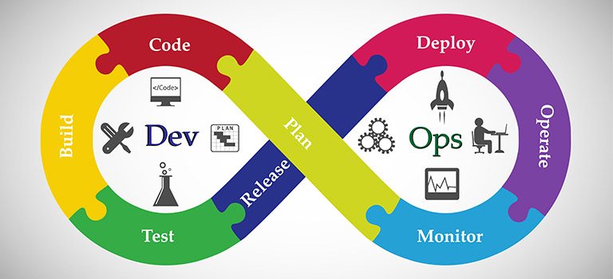
 
# 🚀 DevOps Full Platform Project

A production-style DevOps project that demonstrates end-to-end system design, deployment, and monitoring using modern DevOps tools and practices.

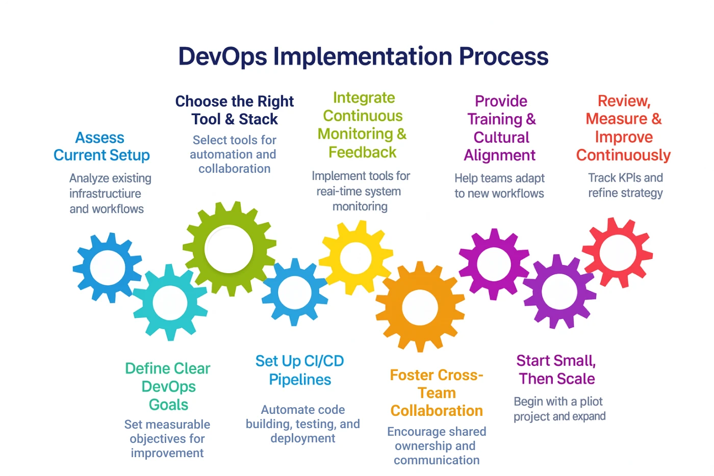

# 🧩 Architecture Overview

This project integrates:

            Infrastructure as Code → Terraform (AWS)
            Containerization → Docker
            Orchestration → Kubernetes
            CI/CD Pipeline → GitHub Actions
            Monitoring → Prometheus + Grafana

# ⚙️ Workflow

            Developer pushes code to GitHub
            GitHub Actions builds Docker image
            Image is pushed to DockerHub
            Kubernetes pulls latest image and deploys
            Prometheus collects metrics
            Grafana visualizes system performance

# 🏗️ Infrastructure Setup

            AWS EC2 instances provisioned using Terraform
            Custom VPC with public/private subnets
            Security groups configured for controlled access

# 🐳 Application Deployment

            Node.js application containerized using Docker
            Kubernetes Deployment manages pods
            Service exposes application externally
 
# 🔄 CI/CD Pipeline

            Automated build on code push
            Docker image pushed to registry
            Kubernetes deployment updated automatically

# 📊 Monitoring Stack

            Prometheus scrapes system and application metrics
            Node Exporter provides server-level metrics
            Grafana dashboards visualize CPU, memory, and app performance

# 📁 Project Structure

            .
            ├── terraform/ 
            ├── app/
            ├── docker/
            ├── k8s/
            ├── monitoring/
            ├── .github/workflows/
            └── README.md

# ▶️ How to Run

1. Provision Infrastructure

            cd terraform
            terraform init
            terraform apply

2. Build Docker Image

            docker build -t your-dockerhub-username/app:latest .
            docker push your-dockerhub-username/app:latest

3. Deploy to Kubernetes

            kubectl apply -f k8s/

4. Setup Monitoring

            kubectl apply -f monitoring/

# 🎯 Outcome

This project demonstrates the ability to:

            Design scalable infrastructure
            Automate deployments
            Manage containerized workloads
            Implement observability

# Screenshots

Terraform init

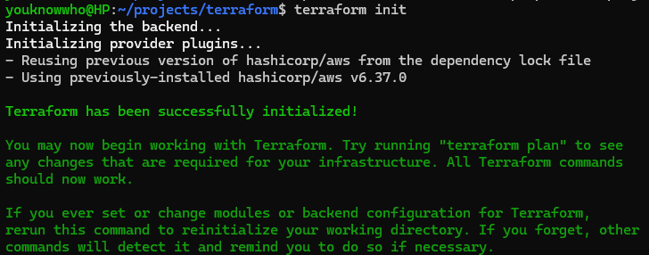

Terraform Plan

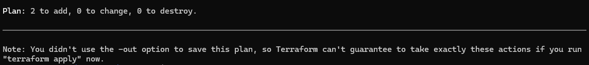

Terraform Apply

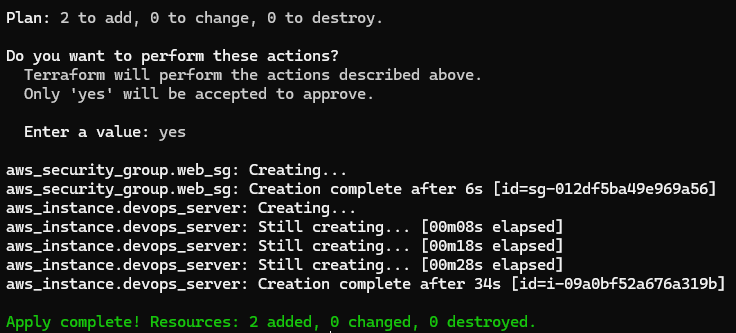

Terraform Destroy

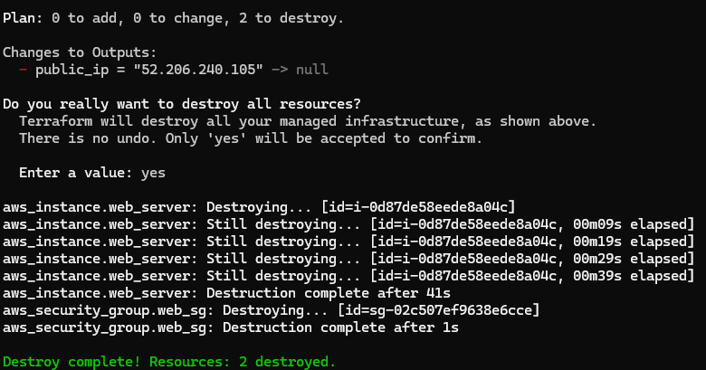

Docker

docker build -t your-dockerhub-username/app:latest .

docker push your-dockerhub-username/app:latest

Deploy to Kubernetes

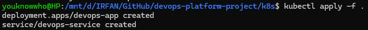 

Kubernetes Deployment manages pods

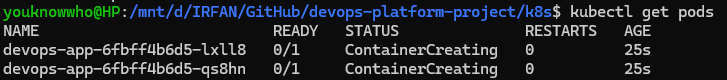 

Kubernetes Deployment Manages Nodes

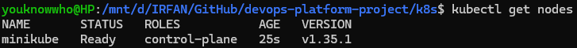 
 
Kubernetes Service exposes application externally

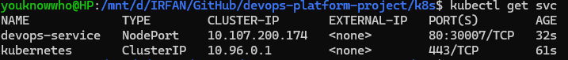 

Automated build on code push

 

Prometheus scrapes system and application metrics

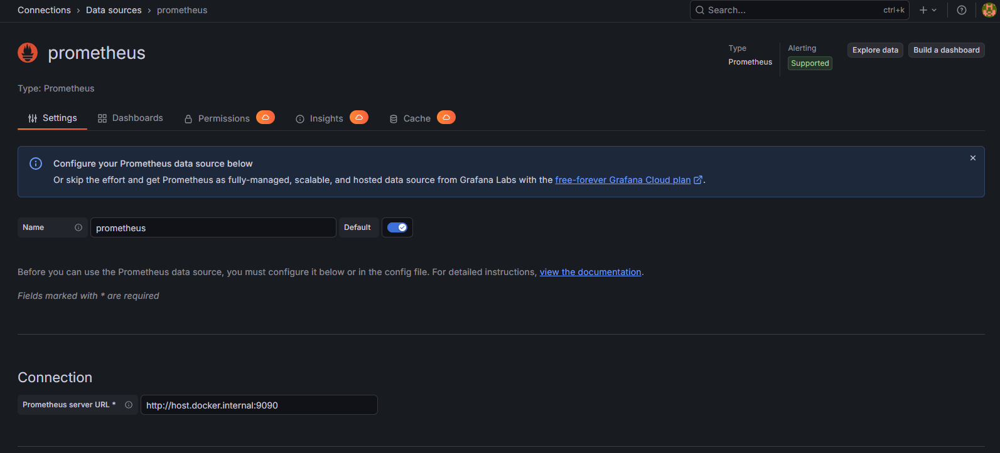 

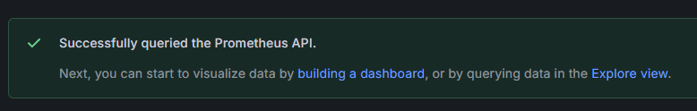 

Prometheus Target Status

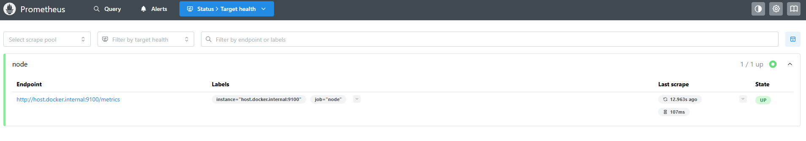 

Grafana Import Dashboard

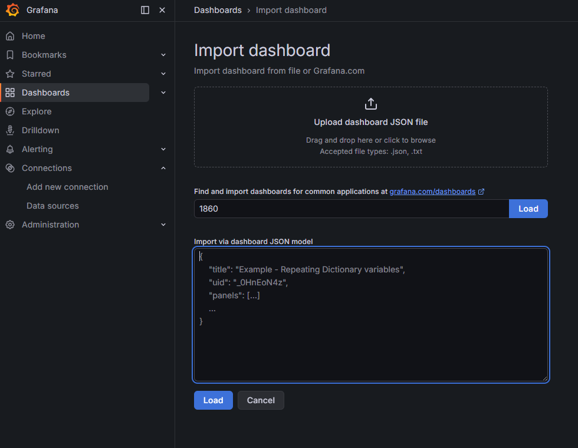 

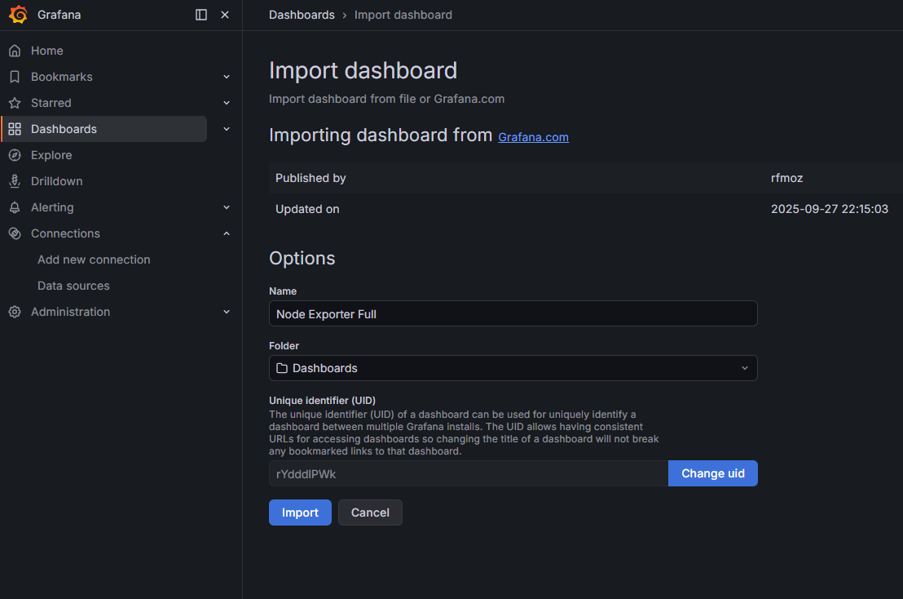 

Grafana dashboards visualize CPU, memory, and app performance

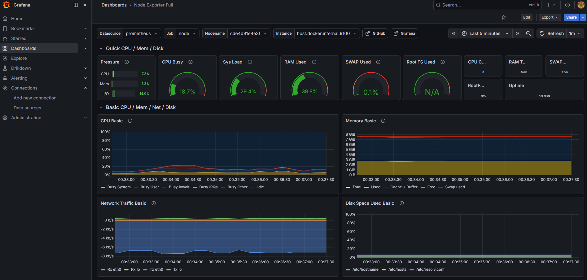 

DevOps Project Deploy on GitHub Actions

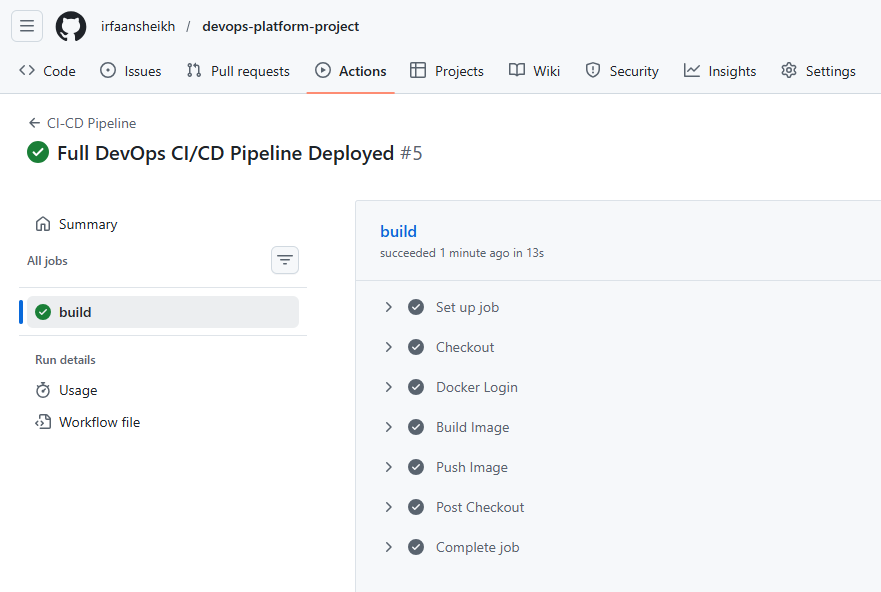
